# PWA Studio Redesign Brief

This brief documents the current state of the “Liefdesliedje Studio” progressive web app so a product designer can reimagine the experience with confidence. It captures the live functionality (October 2025), the key screens, interaction flows, and the structural “skeleton plane” that underpins the product today.

---

## 1. Context & Goals
- **Product intent**: chat-led assistant that turns a couple’s story into lyrics and finally a generated song with Suno V5. Works on desktop (multi-column studio) and mobile/PWA (single-column app shell).
- **Technology constraints**: Next.js App Router, InstantDB for data, Suno API for generation, Tailwind-based styling, PWA service worker + push notifications.
- **Design goal**: deliver a cohesive, native-feeling PWA that guides users from story sharing → lyric curation → music creation → library browsing, while supporting a future Phase 2 (15s reference recording & uploads).

---

## 2. Experience Overview
### 2.1 Entry points
| Route | Platform | Purpose |
|-------|----------|---------|
| `/studio` | Desktop + Mobile | Primary conversational studio (chat + lyric tools + music generation). |
| `/library` | Mobile + Desktop | Lists past songs grouped by conversation (placeholder visuals today). |
| `/` | Desktop | Marketing/landing experience (unchanged in this redesign). |

### 2.2 Global UI primitives
- **Mobile navigation**: fixed `NavTabs` (Chat / Bibliotheek / Instellingen). Currently Settings is a placeholder route.
- **Floating controls**: “Lyrics & instellingen” pill opens the lyric panel overlay; `AudioMiniPlayer` floats above the nav when a stream URL exists.
- **Typography**: Inter (body) + Playfair Display (headers), weight palette 400–700.
- **Color palette**: blush pink (`#ec4899`), gray neutrals (`#f3f4f6`, `#6b7280`), gradient highlights (pink → purple), white backgrounds.
- **PWA shell**: service worker registered via `ClientBoot`, `manifest.webmanifest` sets `display: standalone`, offline fallback at `public/offline.html`.

---

## 3. Screen Inventory & Skeleton Plane

### 3.1 Mobile Studio (Chat Shell)
Purpose: Guide a user through a conversational intake, surface lyrics, and launch music generation.

```
┌───────────────────────────────┐
│ 💕 Liefdesliedje Studio        │ ← Fixed header (title & readiness)
│ Maak je persoonlijke liedje    │
├───────────────────────────────┤
│ ┌ chat bubbles …             │ │
│ │ user ⇢ pink / assistant     │ │ ← Scrollable messages only
│ └ …                           │ │
│ ░ typing indicator            │ │
├───────────────────────────────┤
│ ComposerControls (chips, CTA) │
│ [input field________________] │ ← Sticky composer (above nav)
│ [Verstuur]                    │
├───────────────────────────────┤
│ Floating: Lyrics & instellingen│ ← Opens overlay
├───────────────────────────────┤
│ AudioMiniPlayer (when active) │
├───────────────────────────────┤
│ Chat · Bibliotheek · Settings │ ← Fixed NavTabs
└───────────────────────────────┘
```

States:
- **Hydrating**: full-screen loader (“Mobiele ervaring laden…”).
- **Hydration error**: Dutch copy with retry button.
- **Generating lyrics**: assistant posts transition message; loader dots show.
- **Lyrics ready**: message with cue, latest lyrics stored, overlay CTA highlight.
- **Music generating**: modal overlay with `MusicGenerationProgress` (3-stage timer).
- **Music ready**: variant selector modal (list of tracks).

Key interactions:
- Text input & composer chips.
- Surprise template increments analytics.
- Floating button toggles lyrics overlay (see 3.2).
- Polling integrated: stops when status `'complete'` pulled via mobile API or Instant subscription.

### 3.2 Lyrics Overlay (Mobile)
Purpose: Show lyric options/history, refinement, settings.

```
┌────────────────────────────────┐
│ Lyrics & instellingen    [Sluit]│ ← Overlay header
├────────────────────────────────┤
│ Gathering state: readiness bar │
│ Context accordion, concept     │
│   lyrics, preferences form     │
│--------------------------------│
│ Lyrics history list            │
│   - cards with expand/collapse │
│--------------------------------│
│ Actions:                       │
│  • “Genereer muziek” (CTA)     │
│  • “Vraag om verfijning” (text)│
│  • Manual edit modal           │
└────────────────────────────────┘
```

Overlay behavior: slides up to ~80% viewport height, dims chat beneath, scrollable interior. Dismiss via “Sluit” or backdrop tap.

### 3.3 Library Screen
Current implementation: static placeholder pending data wiring. Skeleton:

```
┌───────────────────────────────┐
│ Jouw bibliotheek              │
├───────────────────────────────┤
│ “Je recente liedjes ...”      │ text
│ [Empty-state illustration]    │ (N/A yet)
│ …                              │
├───────────────────────────────┤
│ NavTabs                        │
└───────────────────────────────┘
```

Future states call for grouped conversation cards, swipe-to-delete, long-press favorites.

### 3.4 (Placeholder) Settings
- Route linked from nav but no UI yet. Opportunity to define notification toggles, PWA install hints, language, etc.

### 3.5 Desktop Studio
- Three-column layout: Template selector | Chat | Lyrics panel.
- Shares logic but without mobile overlay or nav.

Skeleton plane summary:
- **Surface**: gradient backgrounds, card-based modules, consistent padding.
- **Structure**: top-level sections (chat frame, lyric tools, music progress).
- **Framework**: React client components, Tailwind utility classes, mobile-first.

---

## 4. Interaction Flows

Each flow below is documented in prose and supported by a Mermaid diagram with explicit decision nodes (`{ }`). The diagrams act as living blueprints for the designer.

### 4.1 Session & Hydration Flow
1. Middleware tags the request with an `x-is-mobile` cookie and security headers.
2. Server component decides whether the mobile or desktop shell should render.
3. If no session cookie is present, the NextAuth exchange route is invoked.
4. Once authenticated, the client hydrates the latest conversation via the mobile API.
5. Missing conversation → create one server-side; otherwise reuse existing state.

```mermaid
flowchart TD
    A[Visit /studio] --> B[Middleware sets cookies & headers]
    B --> C{UA / hints → mobile?}
    C -- yes --> D[Render StudioClient with isMobile=true]
    C -- no --> D2[Render desktop studio shell]
    D --> E{Has session cookie?}
    D2 --> E
    E -- no --> F[POST /api/auth/exchange → set APP_SESSION]
    F --> G[Client boot complete]
    E -- yes --> G
    G --> H[/api/mobile/conversations GET latest/]
    H -- 200 --> I[Seed state with conversation + settings]
    H -- 404 --> J[POST /api/mobile/conversations]
    J --> I
    I --> K[Chat UI ready]
```



### 4.2 Conversation Loop & Lyrics Trigger
1. User submits text → persisted through `/api/mobile/messages`.
2. Server conversation agent returns assistant reply, updated context, readiness score.
3. Decision: should we auto-transition to lyric generation (min rounds, readiness threshold, or explicit user intent)?
4. If not, loop continues; otherwise the lyric generation pipeline is invoked.

```mermaid
flowchart TD
    U[User sends message] --> S[POST /api/mobile/messages]
    S --> A[/api/chat/conversation]
    A --> R[Assistant reply + readiness score]
    R --> D1{Detect trigger phrase?}
    D1 -- yes --> L[Start lyrics generation]
    D1 -- no --> D2{Rounds >= MIN & score ≥ 0.7?}
    D2 -- yes --> L
    D2 -- no --> Back[Continue conversation]
    L --> T[/api/suno/lyrics POST → taskId]
    T --> P[Poll status]
    P --> P
    P -- status=complete --> O[Push lyric options to UI]
    P -- status=failed --> E[Show error & revert to gathering]
    Back --> U
```

### 4.3 Lyrics Overlay & Refinement
1. Overlay opens either automatically when options are ready or via floating CTA.
2. User decision: accept existing lyric, refine (requires feedback), or manually edit.
3. Each action persists through mobile APIs and updates session state.

```mermaid
flowchart TD
    O[Lyric options available] --> CTA[User taps “Lyrics & instellingen”]
    CTA --> L1[Overlay opens]
    L1 --> D{User choice}
    D -- Select lyric --> SEL[POST /api/lyric-versions (selection)]
    SEL --> Close[Close overlay, mark conversation complete]
    D -- Refine --> REF[Collect feedback + POST /api/suno/lyrics (refine)]
    REF --> PollRefine[Poll status → update variants]
    D -- Manual edit --> MAN[Open text modal → persist edited lyrics]
    MAN --> Close
    PollRefine --> L1
```

### 4.4 Music Generation & Playback
1. Preconditions: lyric selected, template chosen.
2. Optional parameter sheet lets user adjust Suno V5 knobs.
3. Song record is persisted via `/api/mobile/songs`; Suno generation starts.
4. Poll status; on success, user selects a variant which activates the mini-player.


### 4.5 Library Navigation (Future state)
1. Route loads summary list once API wired.
2. Decision nodes capture future gestures: swipe to delete vs long-press favourite.

```mermaid
flowchart TD
    Enter[/library route/] --> Fetch[GET /api/mobile/library (planned)]
    Fetch --> Group[Group by conversation]
    Group --> Card[Render conversation cards]
    Card --> Action{User gesture}
    Action -- Swipe left --> Delete[Confirm delete → PATCH /api/library]
    Action -- Long press --> Fav[Toggle favourite → PATCH]
    Action -- Tap card --> Detail[Open conversation detail (future)]
```

---

## 5. Data & State Lifecycle
- **Server data**: all mobile writes go through Instant Admin API routes (`/api/mobile/**`). Desktop still uses client SDK writes (to be phased out post-redesign).
- **Local state**: React `useState` for chat transcript, lyric options, template selection, polling timers.
- **Polling**: 4 s delay + 5 s interval for lyrics; 5 s interval for song status. Auto-stop when callback marks record `ready`.
- **Error states**:
  - Hydration failure (mobile) → toast-style screen with retry.
  - Suno lyric failure → assistant apology, stays in gathering.
  - Suno song failure → `generationError` message in lyrics pane + retry CTA.

---

## 6. Visual & Brand Notes
- **Iconography**: emoji accents (🎵, 💕), CSS gradients, card shadows (`shadow-lg` etc.).
- **Spacing**: 24 px base on desktop, 16 px on mobile.
- **Button styles**: Primary = pink background, white text, rounded-md (radius 8–12). Secondary = bordered gray.
- **Loading treatments**: spinners, skeleton pulses, Dutch localized copy.
- **Typography scale**:
  - Headers: Playfair Display 24–32 px.
  - Body: Inter 14–16 px.
  - Micro copy: Inter 12 px (uppercase for stage labels).

---

## 7. Known Issues / Opportunities
1. **Desktop vs mobile parity**: mobile path already uses server APIs; desktop still mutates via client SDK → consider unifying for security.
2. **Library view**: currently informational only; requires full design for cards, gestures, empty states.
3. **Settings route**: missing UI. Should host push notification preferences, account management, install help.
4. **Push onboarding**: background service worker exists but no in-app permission priming.
5. **Recording feature (Phase 2)**: `src/components/recorder` exists; needs integration into mobile shell with gating.
6. **Analytics**: currently console logs; centralize into tracking service for designer insights.

---

## 8. Appendix – ASCII Screen Sketches

### A. Mobile Chat (default)
```
┌───────────────────────────────┐
│ 💕 Liefdesliedje Studio        │
│ Ronde 2/6 • Gereedheid 45%     │
├───────────────────────────────┤
│ assistant: “Welkom!”          │
│ user:      “We ontmoetten…”   │
│ assistant typing…             │
│ …                             │
├───────────────────────────────┤
│ ♡ Suggesties: [Verjaardag]    │
│ [ Typ hier je verhaal…    ] []│
│ [Verstuur]                     │
├───────────────┬───────────────┤
│ Lyrics & inst.| ♬ mini player │
├───────────────┴───────────────┤
│ Chat   | Bibliotheek | Instel │
└───────────────────────────────┘
```

### B. Lyrics Overlay (open)
```
┌───────────────────────────────┐
│ Lyrics & instellingen   [Sluit]│
├───────────────────────────────┤
│ Gereedheid-bar ▓▓░░           │
│ Concept lyrics (accordion)    │
│ Song settings (chips/selects) │
├───────────────────────────────┤
│ Latest lyrics card             │
│   “Jouw Liefdesliedje”         │
│   stanza…                      │
│ Actions: [Genereer muziek]     │
│          [Vraag om verfijning] │
│          [Bewerk handmatig]    │
├───────────────────────────────┤
│ Historie (versies v1, v0 …)    │
└───────────────────────────────┘
```

### C. Variant Selector Modal
```
┌───────────────────────────────┐
│ Kies een versie                │
├───────────────────────────────┤
│ • Versie 1  ⏱ 3:02  [Luister]  │
│ • Versie 2  ⏱ 2:55  [Luister]  │
│ • Versie 3  ⏱ 3:10  [Luister]  │
├───────────────────────────────┤
│ [Annuleer]                     │
└───────────────────────────────┘
```

### D. Library Placeholder
```
┌───────────────────────────────┐
│ Jouw bibliotheek              │
├───────────────────────────────┤
│ “Je recente liedjes…”         │
│ (Empty illustration TBD)      │
├───────────────────────────────┤
│ NavTabs                       │
└───────────────────────────────┘
```

---

## 9. Deliverables for New Design
When reimagining the PWA, please focus on:
1. **Mobile-first flow** with tight chat framing (composer always reachable).
2. **Lyric curation** improvements (card stack, gestures, progress states).
3. **Music playback & sharing** (mini player states, share CTA, push prompts).
4. **Library** expansion with meaningful empty / filled / action states.
5. **Settings** & install guidance to encourage PWA adoption.
6. **Error & offline** experiences aligning with Dutch localization and PWA constraints.

This document should equip you with the current landscape so you can propose a refreshed experience grounded in how the app behaves today. For any clarifications, reach out to the engineering contact (Studio team).
