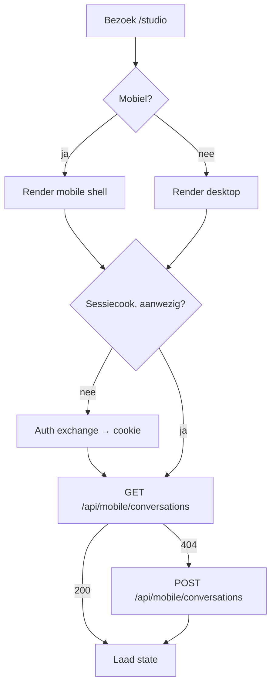
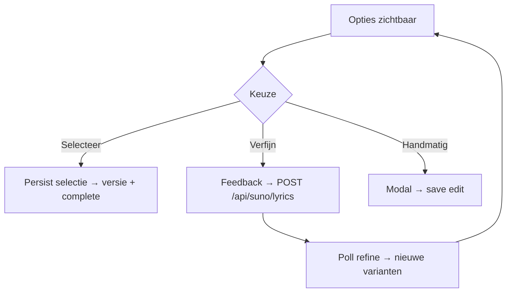
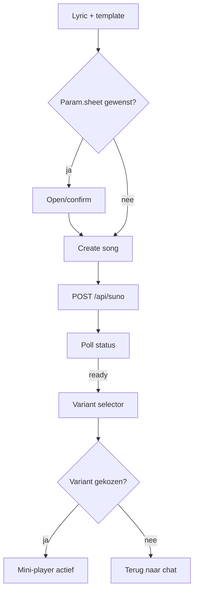
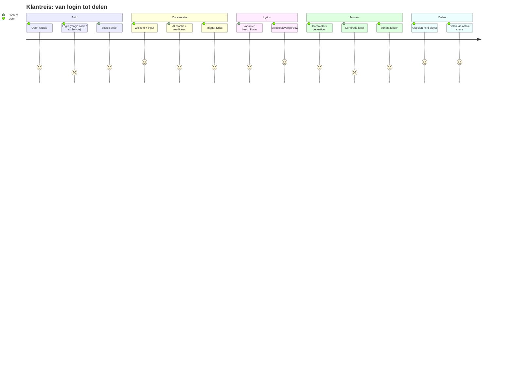

# Huidig Schematisch Overzicht (PWA Studio)

Dit document geeft een compacte schets van de huidige PWA met ASCII‑schetsen en Mermaid‑diagrammen, zodat een designer het nieuwe ontwerp kan definiëren en een developer het kan implementeren.

## Schermen (ASCII)
```
┌───────────────────────────────┐
│ 💕 Studio (titel)             │
├───────────────────────────────┤
│ chat transcript (scrollbaar)  │
├───────────────────────────────┤
│ composer + input (sticky)     │
├───────────────────────────────┤
│ mini‑player (optioneel)       │
├───────────────────────────────┤
│ nav tabs (vast)               │
└───────────────────────────────┘
```

## Flow: sessies & hydratie


## Flow: gesprek → lyrics
```mermaid
flowchart TD
  U[User bericht] --> S[POST /api/mobile/messages]
  S --> A[/api/chat/conversation]
  A --> R[Reply + readiness]
  R --> D{Trigger/score/rounds ok?}
  D -- ja --> L[POST /api/suno/lyrics]
  D -- nee --> U
  L --> P[Poll status]
  P -- complete --> O[Toon opties]
P -- failed --> X[Fout → terug naar chat]
```


## Waarom deze stappen?
- Security: mobiele UI schrijft via serverroutes (`/api/mobile/**`) met Instant Admin SDK → geen client‑mutaties.
- UX: vaste chat‑frame voelt als app; overlay‑sheet voorkomt springende layout en houdt input bereikbaar.
- Performance: polling met back‑off; stoppen zodra callback/status `complete`.

## Extra flow: lyrics‑overlay beslissingen


## Extra flow: muziekgeneratie & playback


## Componenten & bestanden (korte mapping)
- `src/app/studio/StudioClient.tsx` — orkestratie (chat, overlay, polling, mini‑player).
- `src/components/ConversationalStudioLayout.tsx` — mobiele overlay‑sheet + desktop grid.
- `src/components/LyricsPanel.tsx` — readiness, context, acties (refine/edit/generate).
- Server API: `/api/mobile/**` (conversations, messages, songs), `/api/suno/**` (lyrics/music).

## Data & API quick‑ref
- Conversations: `conversationPhase`, `roundNumber`, `readinessScore`, `songSettings`, `lyricsTaskId`.
- Songs/Variants: `status`, `generationParams`, `streamAudioUrl`, `audioUrl`, `order`, timestamps.

## Interactie‑elementen & gedragsregels
- Chat transcript is de enige scrollcontainer; header, composer, nav blijven vast.
- Composer/input blijft zichtbaar (sticky boven NavTabs); zorg voor keyboard‑safe areas.
- Lyrics‑overlay schuift over de chat; backdrop klik of “Sluit” sluit de sheet.
- Variant‑selector toont luistertijden en “Luister”; sluiten bij keuze of via close.
- Mini‑player blijft boven nav; expand/collapse werkt zonder content‑shift.

## Stijl‑aanwijzingen (huidige richting)
- Typografie: Playfair Display (koppen), Inter (body). Kop 24–32px, body 14–16px, micro 12px.
- Palet: pink‑500 (#ec4899), grijs‑neutrals voor vlakken/borders, zachte gradients (pink→purple).
- Spacing: 8‑pt schaal (4/8/12/16/24/32). Radii: 8–12px. Elevation: klein/medium/groot.
- Tailwind utilities waar mogelijk; tokens later centraliseren (CSS vars).

## Ontwerpleveringen (gevraagd)
- Schermspecs per state (loading/empty/error) met safe‑area en iOS/Android verschillen.
- Componentenbibliotheek (Composer, Bubbles, Overlay, Modal, Tabs, Player) + props/varianten.
- Motion‑specs (durations/easings) voor overlay, modal, mini‑player.
- Design tokens (kleur, typografie, spacing, radii, schaduwen) + export (CSS vars).
- Flow‑prototypes (Figma) voor: onboarding, lyrics‑overlay, muziekvarianten, library‑gestures.

---

# Component‑catalogus (props, varianten, states)

## ComposerControls
- Props: `suggestions: string[]`, `onSuggestionClick(s: string)`, `onGenerateNow?()`, `disabled?: boolean`.
- Varianten: inline (default), met FAB‑trigger (mobile).
- States: default, disabled, busy (toon subtiele loader bij serveractie).

## ChatInput
- Props: `value`, `onChange(v)`, `onSubmit()`, `placeholder`, `disabled`.
- Gedrag: Enter = verzenden; keyboard‑safe area; knop “Verstuur” disabled bij lege input.

## ChatBubble
- Props: `role: 'user'|'assistant'`, `content`, `isError?`, `isTyping?`.
- Varianten: user (pink), assistant (wit met schaduw), error (rode rand of icoon).

## ChatTranscript
- Props: `messages`, `autoScrollRef`, `isLoading`.
- Gedrag: alleen deze container scrolt op mobiel; auto‑scroll naar laatste bericht bij nieuwe messages (mits user niet handmatig omhoog is).

## NavTabs
- Props: `active: 'studio'|'library'|'settings'`, `onNavigate(href)`.
- Altijd fixed onderin; z‑index boven content.

## LyricsOverlay (bottom sheet)
- Props: `open`, `onClose()`, `readiness`, `conceptLyrics`, `latestLyrics`, `options: string[]`, `onSelectOption(i)`, `onRefine(feedback)`, `onManualEditSave(text)`, `onGenerateMusic()`, `isRefining`, `canRefine`, `isGeneratingMusic`, `preferences`, `onChangePreferences(p)`.
- Varianten: gathering (context/progress), ready (opties/versies), error (meldingen + retry).
- States: closed, opening, open, closing.

## VariantSelectorModal
- Props: `open`, `variants: {id, title, streamAudioUrl?, audioUrl?, imageUrl?, durationSeconds?}[]`, `onSelect(id)`, `onClose()`.
- Gedrag: lijst met luisterknoppen; sluit na keuze.

## ParameterSheet
- Props: `isOpen`, `defaults: {language, vocalGender, vocalAge?}`, `onConfirm(values)`, `onClose()`, `isSubmitting`.

## MusicGenerationProgressOverlay
- Props: `stage: 1|2|3`, `estimatedTimeRemaining: number`.
- Fullscreen, geblokkeerde achtergrond; sluit wanneer status ready.

## AudioMiniPlayer
- Props: `src`, `expanded?`, `onToggle?`.
- Always‑on‑top boven NavTabs; autoplay met try/catch.

## HydrationScreen / ErrorScreen
- Props: `message`, `onRetry?()`.
- Fullscreen met duidelijke call‑to‑action.

---

# State‑matrix per scherm

## Studio (mobile)
- Hydrating: loader + “Mobiele ervaring laden…”.
- Hydration error: fouttekst + “Probeer opnieuw”.
- Unauthorized (server): login/uitwisseling (UI toont “Log in om te beginnen”).
- Gathering: chat actief; composer enabled; overlay gesloten.
- Generating lyrics: assistant melding + loader; overlay gesloten.
- Lyrics ready: overlay‑CTA zichtbaar; overlay open toont opties/versies.
- Refining lyrics: overlay open, `isRefining=true`, knoppen disabled waar nodig.
- Music generating: progress overlay (stage 1→3), chat geblokkeerd.
- Variants ready: variant‑selector open; keuze activeert mini‑player.
- Errors: `generationError` in overlay met Retry/Adjust‑actions.

## LyricsOverlay
- Closed → Open (gathering/ready).
- Empty history → Cards met versies → Expanded card.
- Actions: Select (persist), Refine (Suno refine), Manual Edit (persist).

## VariantSelector
- Open/closed; lijst niet‑leeg (selecteerbaar) vs leeg (edge case, toon melding/Retry).

## Library
- Empty state (copy/illustratie); Loaded (groepeer op conversatie); Gestures (toekomst).

---

# Klantreis: van login tot delen

1) Bezoek & Login
- Gebruiker opent `/studio` (mobiel of desktop). Middleware kiest juiste shell.
- Auth‑exchange zet een `APP_SESSION` cookie. Bij fout: duidelijke melding + “Opnieuw proberen”.

2) Conversatie Onboarding
- Welkom + korte uitleg. Suggestiechips stimuleren eerste input.
- Gebruiker deelt kernmoment(en); assistant reageert en verhoogt “readiness”.
- Beslissing: bij triggerzin of voldoende rondes/score → lyrics genereren; anders verder vragen stellen.

3) Lyrics Ontvangst & Keuze
- Overlay opent (of via CTA) met 2+ varianten. Keuzes:
  - Selecteren (persist als versie, markeer conversatie ‘complete’)
  - Verfijnen (feedback → nieuwe varianten)
  - Handmatig bewerken (persist eigen tekst)

4) Muziekgeneratie
- Optioneel parameters finetunen (taal, vocalGender, leeftijd).
- Server maakt songrecord aan en start Suno; progress overlay toont stages (1→3).
- Fout? Toon `generationError` + acties (Retry/Aanpassen lyrics).

5) Variant & Afspelen
- “Kies een versie” modal; na keuze start `AudioMiniPlayer` en blijft zichtbaar boven nav.
- Push (indien toegestaan) kan “Song is klaar” sturen; navigeer direct naar de variant.

6) Delen
- Deelknop opent native share sheet (titel + link/stream). Communiceer downloadoptie en licentie‑copy.


