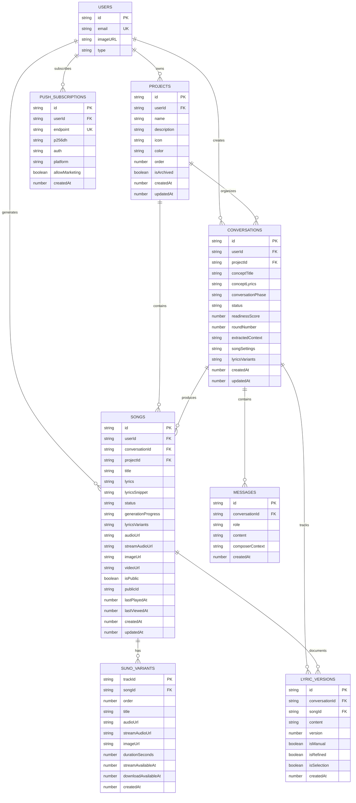

# Library Data Model - Entity Relationship Diagram

## Mermaid ERD



## Simplified Visual Representation

```
┌────────────────────────────────────────────────────────────────────────┐
│                              $USERS                                    │
│  - id (PK)                                                             │
│  - email (UK, indexed)                                                 │
│  - imageURL                                                            │
└────┬──────────────────┬──────────────────┬──────────────────┬─────────┘
     │                  │                  │                  │
     │ owns             │ creates          │ generates        │ subscribes
     │                  │                  │                  │
     ▼                  ▼                  ▼                  ▼
┌─────────────┐   ┌──────────────┐   ┌──────────────┐   ┌────────────────┐
│  PROJECTS   │   │CONVERSATIONS │   │    SONGS     │   │PUSH_SUBSCRIPTION│
│             │   │              │   │              │   │                │
│ - name      │   │ - conceptTitle  │ - title      │   │ - endpoint     │
│ - color     │   │ - phase      │   │ - status     │   │ - p256dh       │
│ - icon      │   │ - readiness  │   │ - lyrics     │   │ - auth         │
│ - isArchived│   │ - context    │   │ - audioUrl   │   └────────────────┘
└─────┬───────┘   └──────┬───────┘   │ - imageUrl   │
      │                  │            └──────┬───────┘
      │ organizes        │ contains          │ has
      │                  │                   │
      └──────────┬───────┴─────┬─────────────┼────────────┐
                 │             │             │            │
                 ▼             ▼             ▼            │
           ┌──────────┐  ┌──────────┐  ┌──────────────┐  │
           │CONVERSATI│  │ MESSAGES │  │SUNO_VARIANTS │  │
           │ONS (dupe)│  │          │  │              │  │
           └──────────┘  │ - role   │  │ - trackId    │  │
                         │ - content│  │ - audioUrl   │  │
                         └──────────┘  │ - order      │  │
                              │        └──────────────┘  │
                              │                          │
                              ▼                          ▼
                         ┌──────────────┐          ┌────────────┐
                         │LYRIC_VERSIONS│          │(relations) │
                         │              │          └────────────┘
                         │ - content    │
                         │ - version    │
                         │ - isRefined  │
                         │ - isManual   │
                         └──────────────┘
```

## Key Relationships Explained

### User Ownership
```
User (1) ─── owns ──→ (n) Projects
User (1) ─── creates ──→ (n) Conversations
User (1) ─── generates ──→ (n) Songs
User (1) ─── subscribes ──→ (n) Push Subscriptions
```

### Project Organization
```
Project (1) ─── organizes ──→ (n) Conversations [CASCADE DELETE]
Project (1) ─── contains ──→ (n) Songs [CASCADE DELETE]
```
**Note:** When a project is deleted, all its conversations and songs are automatically deleted.

### Conversation Flow
```
Conversation (1) ─── contains ──→ (n) Messages
Conversation (1) ─── produces ──→ (n) Songs
Conversation (1) ─── tracks ──→ (n) Lyric Versions
```

### Song Variants & Versions
```
Song (1) ─── has ──→ (n) Suno Variants (2-4 typically)
Song (1) ─── documents ──→ (n) Lyric Versions
```

## Cardinality Summary

| Relationship | Type | Cascade Delete | Indexed |
|--------------|------|----------------|---------|
| Users → Projects | 1:N | No | userId indexed |
| Users → Conversations | 1:N | No | userId indexed |
| Users → Songs | 1:N | No | userId indexed |
| Users → Push Subscriptions | 1:N | No | userId indexed |
| Projects → Conversations | 1:N | Yes | projectId indexed |
| Projects → Songs | 1:N | Yes | projectId indexed |
| Conversations → Messages | 1:N | No | conversationId indexed |
| Conversations → Songs | 1:N | No | conversationId indexed |
| Conversations → Lyric Versions | 1:N | No | conversationId indexed |
| Songs → Suno Variants | 1:N | No | songId indexed |
| Songs → Lyric Versions | 1:N | No | songId indexed |

## Data Flow Diagram (Library Context)

```
┌─────────────────────────────────────────────────────────────────┐
│                        USER REQUEST                             │
│                     GET /api/mobile/library/songs               │
└────────────────────────────────┬────────────────────────────────┘
                                 │
                                 ▼
┌─────────────────────────────────────────────────────────────────┐
│                         QUERY BUILDER                           │
│  - Apply filters (status, search)                               │
│  - Apply sorting (action, recent, az, played)                   │
│  - Pagination (limit, offset)                                   │
└────────────────────────────────┬────────────────────────────────┘
                                 │
                                 ▼
┌─────────────────────────────────────────────────────────────────┐
│                       INSTANTDB QUERY                           │
│  db.query({                                                     │
│    songs: {                                                     │
│      $: { where, order, limit },                                │
│      variants: { $: { order: { order: 'asc' } } },            │
│      user: {},                                                  │
│      conversation: {}                                           │
│    }                                                            │
│  })                                                             │
└────────────────────────────────┬────────────────────────────────┘
                                 │
                                 ▼
┌─────────────────────────────────────────────────────────────────┐
│                      RESPONSE TRANSFORM                         │
│  - Parse generationProgress JSON                                │
│  - Parse lyricsVariants JSON                                    │
│  - Parse notificationsSent JSON                                 │
│  - Sort variants by order                                       │
│  - Calculate metadata (time ago, etc.)                          │
└────────────────────────────────┬────────────────────────────────┘
                                 │
                                 ▼
┌─────────────────────────────────────────────────────────────────┐
│                         RENDER CARDS                            │
│  SongCard[] with:                                               │
│  - Cover image                                                  │
│  - Status badge                                                 │
│  - Primary CTA (dynamic)                                        │
│  - Variant selector                                             │
│  - Actions (share, delete)                                      │
└─────────────────────────────────────────────────────────────────┘
```

## Status State Machine (Songs)

```
┌──────────┐
│ pending  │ Initial creation
└────┬─────┘
     │ Start lyrics generation
     ▼
┌─────────────────┐
│generating_lyrics│ Waiting for Suno callback
└────┬────────────┘
     │ Lyrics callback received
     ▼
┌─────────────┐
│lyrics_ready │ ◄─── USER ACTION REQUIRED
└────┬────────┘       (select 1 of 2 variants)
     │ User selects variant
     ▼
┌─────────────────┐
│generating_music │ Waiting for Suno music callback
└────┬────────────┘
     │ Music callback received
     ▼
┌──────┐
│ready │ ◄─── USER ACTION AVAILABLE
└────┬─┘       (play, share)
     │ User plays song
     ▼
┌─────────┐
│complete │ Final state
└─────────┘

         Any step can transition to:
         ┌────────┐
         │failed  │ ◄─── USER ACTION AVAILABLE
         └────────┘       (retry)
```

## Phase Flow (Conversations)

```
┌──────────┐
│gathering │ User chatting, AI extracting context
└────┬─────┘
     │ Readiness score ≥ 70%
     ▼
┌───────────┐
│generating │ Suno generating 2 lyric variants
└────┬──────┘
     │ Variants ready
     ▼
┌─────────┐
│refining │ User can request 1 refinement
└────┬────┘
     │ User satisfied
     ▼
┌─────────┐
│complete │ Song(s) generated
└─────────┘
```

## Indexed Fields Reference

**Critical for Performance:** These fields MUST be indexed for efficient querying.

### Songs
- `userId` - User ownership filter
- `projectId` - Project filter
- `conversationId` - Link to conversation
- `status` - Status filter
- `title` - Sorting A-Z
- `lyricsSnippet` - Search
- `lastPlayedAt` - Sorting by played
- `lastViewedAt` - Activity tracking
- `createdAt` - Default sorting
- `updatedAt` - Recent sorting
- `isPublic` - Public sharing filter
- `publicId` - Public link lookup

### Conversations
- `userId` - User ownership filter
- `projectId` - Project filter
- `conceptTitle` - Search & sort
- `conversationPhase` - Phase filter
- `status` - Status filter
- `createdAt` - Default sorting
- `updatedAt` - Recent sorting

### Suno Variants
- `trackId` - Primary key (Suno ID)
- `songId` - Parent song lookup
- `order` - Sorting variants
- `createdAt` - Default sort

### Messages
- `conversationId` - Parent lookup (NOT indexed - intentional)
- `createdAt` - Chronological order

## JSON Field Structures

### songs.generationProgress
```json
{
  "lyricsTaskId": "abc123",
  "lyricsStartedAt": 1704672000000,
  "lyricsCompletedAt": 1704672045000,
  "lyricsError": null,
  "lyricsRetryCount": 0,
  "musicTaskId": "def456",
  "musicStartedAt": 1704672100000,
  "musicCompletedAt": null,
  "musicError": "Rate limit exceeded",
  "musicRetryCount": 1,
  "rawCallback": { ... }
}
```

### songs.lyricsVariants
```json
[
  {
    "text": "[Verse 1]\nIn the morning light...",
    "variantIndex": 0,
    "selected": false
  },
  {
    "text": "[Verse 1]\nWhen the stars align...",
    "variantIndex": 1,
    "selected": true
  }
]
```

### conversations.extractedContext
```json
{
  "memories": [
    "First met at a coffee shop",
    "Loves to dance in the rain"
  ],
  "emotions": ["warmth", "joy", "gratitude"],
  "partnerTraits": ["kind", "adventurous", "creative"],
  "relationshipLength": "3 years",
  "musicStyle": "acoustic ballad",
  "specialMoments": ["Anniversary trip to Paris"],
  "language": "Nederlands",
  "vocalGender": "female",
  "vocalAge": "mature",
  "vocalDescription": "warm, soulful"
}
```

### conversations.songSettings
```json
{
  "tempo": "medium",
  "instrumentation": "acoustic",
  "mood": ["romantic", "nostalgic"],
  "makeInstrumental": false,
  "language": "Nederlands",
  "vocalGender": "female",
  "vocalAge": "mature",
  "vocalDescription": "warm and expressive"
}
```

---

**Document Version:** 1.0
**Last Updated:** 2025-01-07
